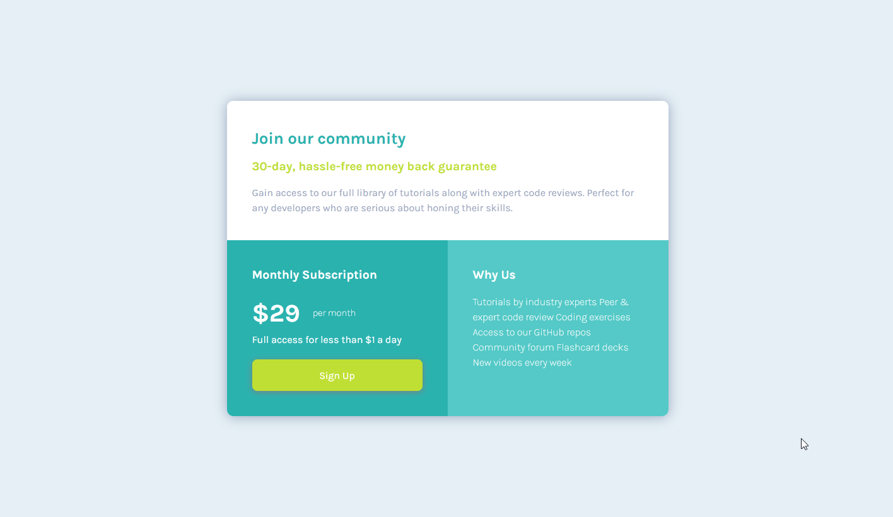

# Frontend Mentor - Single price grid component solution

This is a solution to the [Single price grid component challenge on Frontend Mentor](https://www.frontendmentor.io/challenges/single-price-grid-component-5ce41129d0ff452fec5abbbc). Frontend Mentor challenges help you improve your coding skills by building realistic projects.

## Table of contents

- [Overview](#overview)
  - [Screenshot](#screenshot)
  - [Links](#links)
- [My process](#my-process)
  - [Built with](#built-with)
  - [What I learned](#what-i-learned)
  - [Continued development](#continued-development)
  - [Useful resources](#useful-resources)
- [Author](#author)

## Overview

### Screenshot

### Links

- Source Code URL: [Source Github](https://github.com/lenez12/Single-price-grid-component.git)
- Live Site URL: [Demo Live](https://lenez-single-price.netlify.app/)

## My process

### Built with

- Semantic HTML5 markup
- CSS custom properties
- Flexbox
- Grid CSS

### What I learned

what I learned in making this challenge is:

1. using grid css for layouting content
2. i user media Query to build responsive for mobile combinating with grid css

### Continued development

1. In the future I will make a good css class naming name
2. add transition and animation on content when appears

### Useful resources

- [CSS Grid Layout](https://www.w3schools.com/css/css_grid.asp)
- [Reset CSS](https://piccalil.li/blog/a-modern-css-reset/)

## Author

- Frontend Mentor - [@Lenez](https://www.frontendmentor.io/profile/lenez)
- Twitter - [@prak_tech](https://www.twitter.com/prak_tech)

